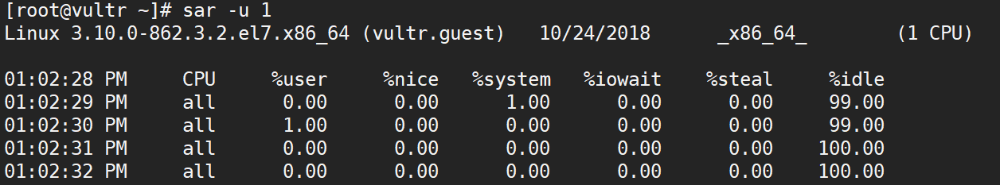
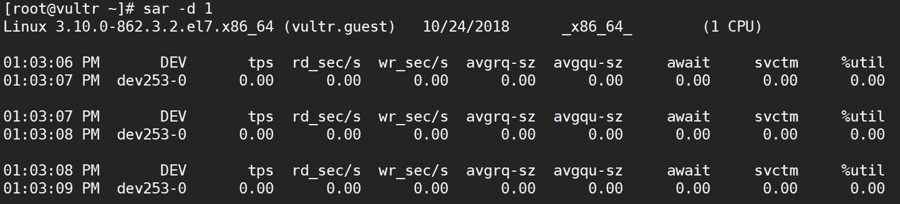
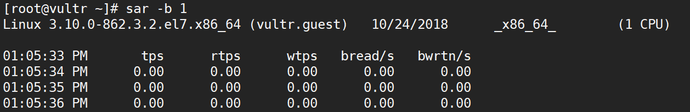
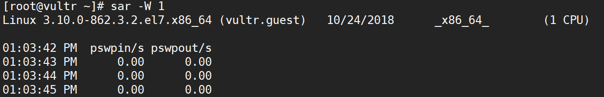
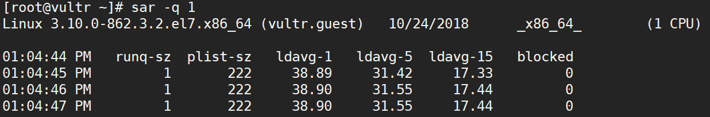
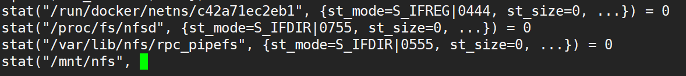
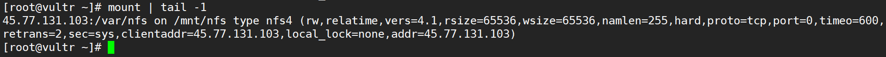

# nfs挂载问题导致df命令HANG住
## 准备环境
模拟nfs服务端问题导致nfs客户端的进行hand死，具体表现为调用`df`命令或者涉及访问该目录的命令时界面会hang住，如果大量后台进行调用访问该目录会导致`uptime`下的负载较高，而实际所有的sar检查都没有发现任何性能问题。

为了重现环境，需要在准备一台服务器（既做客户端也做服务端）
### 安装nfs rpm包并启动服务
```console
[root@vultr ~]# yum install nfs-utils -y
[root@vultr ~]# systemctl start nfs
[root@vultr ~]# systemctl start rpcbind
```

### 创建nfs服务端共享目录
```console
[root@vultr ~]# mkdir /var/nfs
[root@vultr ~]# chmod 755 /var/nfs/
[root@vultr ~]# chown nfsnobody:nfsnobody /var/nfs/
```

### 将目录共享
修改/etc/exports配置文件，将新创建的共享目录写入文件，并以读写模式进行共享。
```console
[root@vultr nfs]# cat /etc/exports
/var/nfs	*(rw,sync)
[root@vultr ~]# exportfs -a
```

### 确认共享情况并挂载
```console
[root@vultr ~]# showmount -e 149.28.143.23
Export list for 149.28.143.23:
/var/nfs *
[root@vultr ~]# mount -t nfs 149.28.143.23:/var/nfs /mnt/nfs
[root@vultr ~]# df
Filesystem             1K-blocks    Used Available Use% Mounted on
/dev/vda1               25778760 2714472  21737248  12% /
devtmpfs                  496928       0    496928   0% /dev
149.28.143.23:/var/nfs  25778816 2714496  21737344  12% /mnt/nfs
```

所有环境都准完毕，目录已经挂载，下一步进行nfs服务端的停止操作

## 实验
将nfs server进程停止，模拟NFS服务端故障导致客户端挂起，此时`df`命令无法正常运行。
```console
[root@vultr nfs]# systemctl stop nfs
[root@vultr nfs]# df
此处hang住
```

首先系统的表现为观察uptime的负载非常高，单个CPU的服务器一分钟负载去到17，表明多个进程在系统运行队列中.

`uptime`: System load averages is the average number of processes that are either in a runnable or uninterruptable state.

如下：


检查sar情况可以证明大部分进程在等待运行：

- sar -u 观察CPU情况

    cpu使用率非常低，大部分为idle，说明没有进程在等待cpu资源。

- sar -d 观察磁盘情况
    磁盘dev253-0的tps几乎为0，说明没有什么进程时等待磁盘。

- sar -b 观察IO情况
    IO设备的读写tps都几乎为0，瓶颈明显不足IO设备

- sar -W 观察换页情况
    当时几乎没有进行换页操作

- sar -q 观察队列情况
    队列情况初步指出问题所在，大量队列堆积在任务列表中未执行，继续考虑进程问题。


根据最明显的问题根源“**`df`操作hang死**”，通过`strace`去分析`df`命令的系统调用及信号情况，可以明显发现`df`是在系统调用尝试获取目录/var/nfs的stat信息时挂起，如下：



再观察系统的`mount`信息，发现通过nfs挂载以下目录/mnt/nfs



问题基本就在`df`在访问/mnt/nfs信息是hang住，通过`ps aux`抓取系统运行的`df`进程信息（大量`df`,状态为D+(无法中断的休眠状态,后台)），如下：
```console
[root@vultr ~]# ps aux | grep df | wc -l
202
[root@vultr ~]# ps aux | grep -w df | head -5
root      2793  0.0  0.1 108020   760 pts/0    D+   14:38   0:00 df
root      2794  0.0  0.1 108020   764 pts/0    D+   14:38   0:00 df
root      2795  0.0  0.1 108020   760 pts/0    D+   14:38   0:00 df
root      2796  0.0  0.1 108020   760 pts/0    D+   14:38   0:00 df
root      2797  0.0  0.1 108020   764 pts/0    D+   14:38   0:00 df
```

通过`umount -lf`强制卸载文件系统，`df`恢复正常,通过`killall df`将大量的残余df进程中止后系统负载下降。
```console
[root@vultr ~]# umount -lf /mnt/nfs
[root@vultr ~]# umount 

Usage:
 umount [-hV]
 umount -a [options]
 umount [options] <source> | <directory>
Options:
 -a, --all               unmount all filesystems
 -f, --force             force unmount (in case of an unreachable NFS system)
 -l, --lazy              detach the filesystem now, and cleanup all later
 [root@vultr ~]#
 [root@vultr ~]# df
Filesystem     1K-blocks    Used Available Use% Mounted on
/dev/vda1       20616252 1595120  17956236   9% /
devtmpfs          238888       0    238888   0% /dev
tmpfs             249668       0    249668   0% /dev/shm
tmpfs             249668    8684    240984   4% /run
tmpfs             249668       0    249668   0% /sys/fs/cgroup
tmpfs              49936       0     49936   0% /run/user/0
[root@vultr ~]#
[root@vultr ~]# uptime
 14:52:56 up  1:11,  2 users,  load average: 5.68, 84.24, 79.26


```

