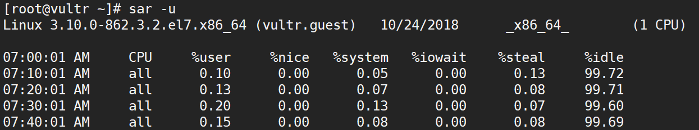
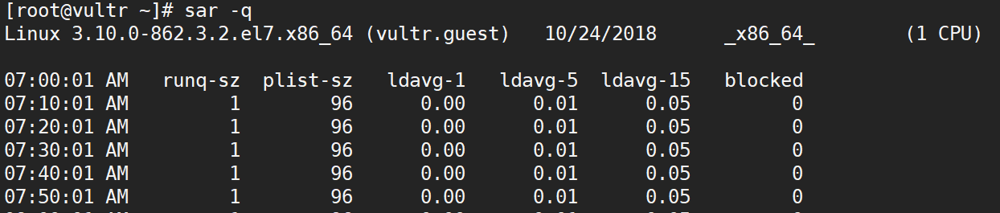
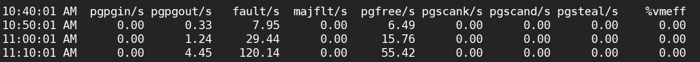
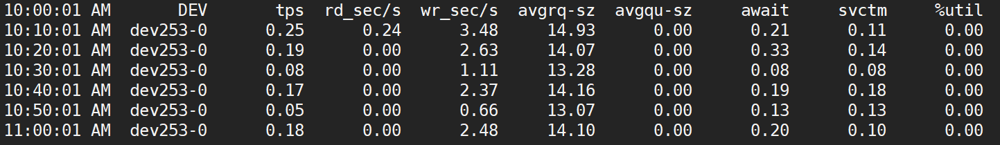
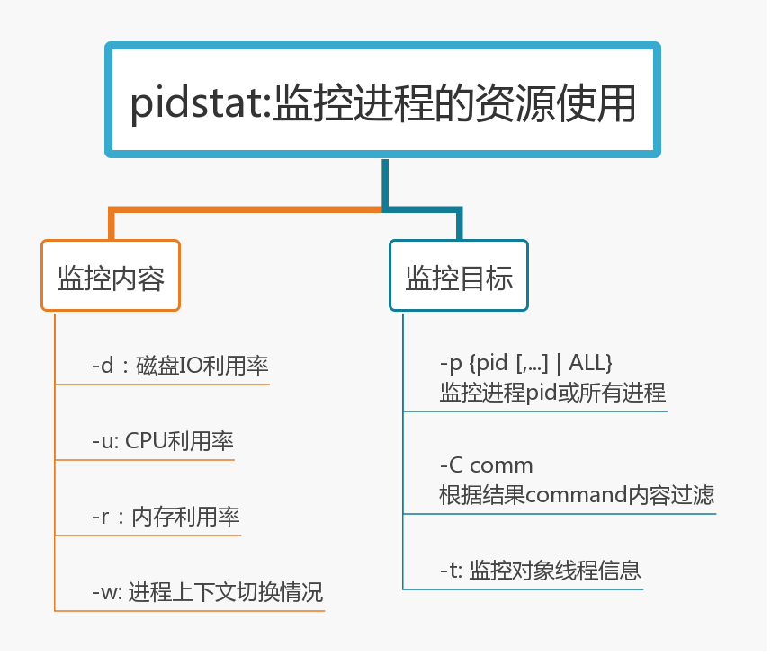

# 系统性能分析类

## sar分析系统性能

sar由sysstat rpm包提供，如果系统不自带，可通过`yum install sysstat`安装

### 怀疑CPU

- sar -u看利用率

- sar -q看队列

>runq_sz:准备运行的进程队列
>
>ldavg-1/5/15：1/5/15分钟负载

### 怀疑内存

- sar -B 换页信息, sar -r , sar -W

>pgpgin:从磁盘或swap换入到系统
>
>pgpgout：从系统唤出到磁盘或swap
>
>pswpin:系统换入swap页面数
>
>pswpout：系统换出swap页面数

### 怀疑IO

- sar -b IO设备信息, sar -u , sar -d看磁盘
>svctm: 平均每次IO请求的处理时间(毫秒为单位)
>
>await:平均每次IO请求的等待时间（包括等待和处理，毫秒为单位）
>
>avgqu-sz：平均等待处理的IO请求队列长度

## pidstat

The pidstat command is used for monitoring individual tasks currently being managed by the Linux kernel.

pidstat命令可以监控进程占用系统资源的情况

