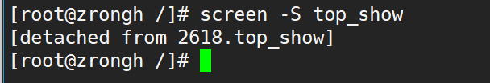
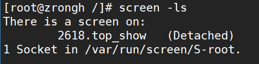
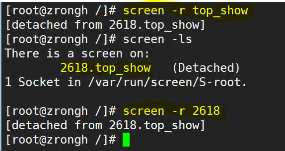

linux screen，将长时间执行的任务后台化（https://www.ibm.com/developerworks/cn/linux/l-cn-screen/）

1. 启动一个名为top_long的窗口
```console
screen -S top_long
```

2. 离开这个窗口并让程序继续执行
```console
CTRL+A+D
```


3. 列出所有窗口
```console
screen -ls
```


4. 重新进入名为top_long的窗口
```shell
screen -r top_long
```


5. 退出窗口
    在窗口内exit

6. 其他操作
    
    在screen窗口内，可以通过CTRL+A 其他命令进行操作：
    1. CTRL+a ? 帮助
    2. CTRL+a c 新建窗口
    3. CTRL+a n 切换到下一个窗口
    4. CTRL+a p 切换到上一个窗口
    5. CTRL+a d 暂时立刻当前窗口
    6. CTRL+a k kill掉当前窗口
